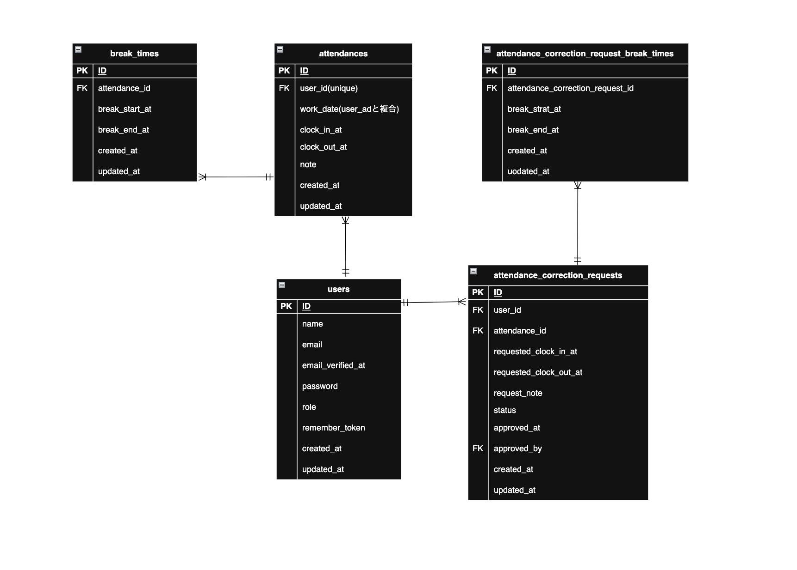

# 模擬案件　勤怠管理アプリ

## アプリ概要
ユーザーが出勤・退勤・休憩打刻を行い、

管理者が勤怠情報や修正申請を管理できる勤怠管理システムです。

一般ユーザーと管理者で画面・機能を分け、

実際の勤怠管理サービスを意識して実装しています。

また、実務を意識して以下の機能も実装しています。

- Laravel Fortify を利用した認証機能
- MailHog を利用したメール認証機能
- PHPUnit を利用した自動テスト
- 管理者による勤怠修正申請承認機能


---

## 環境構築

### Dockerビルド

1. Docker clone
```sh
git clone git@github.com:hirokinoppa/coachtech-attendance-record.git
```

2. Change Directory
```sh
cd coachtech-attendance-record
```

3. Docker Build
```sh
docker-compose up -d --build
```

---

### Laravel環境構築

1. PHPコンテナ内にログイン
```sh
docker compose exec php bash
```

2. composerインストール
```sh
composer install
```

3. .envファイルの作成
```sh
cp .env.example .env
```

4. envファイルの編集(Part1)
ファイル内の一部を書き換えてください。
```sh

DB_CONNECTION=mysql
DB_HOST=mysql
DB_PORT=3306
DB_DATABASE=laravel_db
DB_USERNAME=laravel_user
DB_PASSWORD=laravel_pass

```
5. .envファイルの編集(Part2)
ファイル内の一部を書き換えてください。
```sh

MAIL_MAILER=smtp
MAIL_HOST=mailhog
MAIL_PORT=1025
MAIL_USERNAME=null
MAIL_PASSWORD=null
MAIL_ENCRYPTION=null
MAIL_FROM_ADDRESS=no-reply@example.test
MAIL_FROM_NAME="${APP_NAME}"
MAIL_EHLO_DOMAIN=localhost

```

6. キーの作成
```sh
php artisan key:generate
```

7. マイグレーションの読み込み
```sh
php artisan migrate
```

8. シーダーファイルの読み込み
```sh
php artisan db:seed
```

9. ストレージファイルをリンクさせる
```sh
php artisan storage:link
```

---


## 開発環境
- トップページ：http://localhost/
- 一般ユーザーログイン：http://localhost/login
- 管理者ログイン：http://localhost/admin/login
- phpMyAdmin：http://localhost:8080/
- MailHog(メール認証):http://localhost:8025/


---

## 主な機能
認証機能
- ユーザー登録
- ログイン / ログアウト
- メール認証（MailHog）
- 認証メール再送機能

メール認証完了後に勤怠打刻が可能になります。

## 一般ユーザー機能

勤怠打刻
- 出勤
- 退勤
- 休憩入
- 休憩戻

勤怠一覧
- 月別勤怠一覧表示
- 前月 / 翌月切り替え

勤怠機能
- 勤怠詳細表示
- 修正申請機能
- 修正理由入力

修正申請一覧
- 承認待ち一覧
- 承認済み一覧

---

## 管理者機能

スタッフ管理
- スタッフ管理
- スタッフ別勤怠一覧表示

勤怠管理
- 全ユーザー勤怠一覧表示
- 日別勤怠確認

修正申請承認
- 修正申請一覧
- 承認処理
- 承認済み確認

---

## 使用技術（実行環境）
- PHP 8.2.11
- Laravel 8.83.8
- MySQL 8.0.34
- nginx 1.21.1
- Docker
- Laravel Fortify（認証機能）
- MailHog
- PHPUnit

---

## テーブル設計
- users（ユーザー）
- attendances（勤怠）
- break_times（休憩）
- attendance_correction_requests（修正申請）
- attendance_correction_request_break_times（修正申請の休憩）

---

## テスト
 PHPUnitを使用して機能テストを実装しています。

 テストは本番DBとは別の
 テスト用データベース（coachtech_attendance_test）
 を利用して実行しています。

 これにより、実際のデータを破壊することなく安全にテストを行うことができます。
### テスト用データベースの作成

1. MySQLコンテナにログインする
```sh
docker compose exec mysql bash
```

2. MySQLにrootユーザーでログインする
```sh
mysql -u root -p
```

3. テスト用データベースを作成する
```sh
CREATE DATABASE coachtech_attendance_test CHARACTER SET utf8mb4 COLLATE utf8mb4_unicode_ci;
GRANT ALL PRIVILEGES ON coachtech_attendance_test.* TO 'laravel_user'@'%';
FLUSH PRIVILEGES;
```

4. .env.testingの設定
```sh
APP_ENV=testing

DB_CONNECTION=mysql
DB_HOST=mysql
DB_PORT=3306
DB_DATABASE=coachtech_attendance_test
DB_USERNAME=laravel_user
DB_PASSWORD=laravel_pass

CACHE_DRIVER=array
QUEUE_CONNECTION=sync
SESSION_DRIVER=array
MAIL_MAILER=array
```

---
###　テスト実行

1. PHPコンテナにログインする
```sh
docker compose exec php bash
```

2. テスト用DBにマイグレーションを実行する
```sh
php artisan migrate --env=testing
```

3. テストを実行
```sh
php artisan test
```

---
## 主なテスト

- ユーザー登録
- ログイン
- 管理者ログイン
- メール認証
- 日時取得
- 勤怠ステータス確認
- 出勤機能
- 退勤機能
- 休憩機能
- 勤怠一覧表示
- 勤怠詳細表示
- 修正申請機能
- 管理者承認機能

---

## ER図

本アプリケーションのテーブル構造です。

ユーザーを中心に、
勤怠・休憩・修正申請を管理する構成になっています。



---

